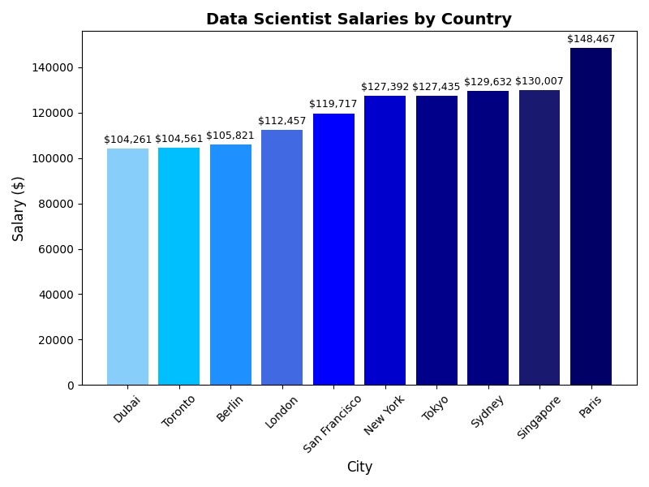

# AI Job Market Insight Analysis
## Data Analysis with Pyhon's Pandas & Matplotlib
### Link
Youtube URL: https://youtu.be/8ySRBhAiSCM

Data URL: https://www.kaggle.com/datasets/uom190346a/ai-powered-job-market-insights

## Table of Contents
- **Introduction**
  - Dataset
  - Visualization

- **Progress of Coding**
  - Initial Data Inspiration
  - Data Cleaning
    - Step One
    - Step Two
    - Step Three
  - Extracting Job Title, Location, and Salary (USD)
  - Visual Graph for Data Scientists

## Intoduction
This is my final CS50x Final Project, where I analyze an `AI Job Market Insights` dataset using Pyhton's Pandas and Matplotlib library. The goal of project is to upload csv file, analyse the file, clean the data, explore job roles based on saleries and visual insights starting with Data Scientist salaries accross different locations. After finishing this prosses, we need to display the DataFrame using the most appropriate graph. I think a histogram is the best choice to show the differences in high salaries across each location.

### Dataset

To upload and read the CSV file, we use the `pd.read_csv` method from **pandas**. Before proceeding, we should ensure that the data is loaded correctly. In this case, the file uses tab separation, so we include `sep="\t"`:

```python
pd.read_csv('ai_job_market_insights.csv', sep="\t")
```

> DataSet Overview
The dataset includes information:
+ Job title
+ Location
+ Industry
+ Salary USD
+ Company size
+ AI adoption level
+ Automation risk
+ Required skills
+ Remote friendly
+ Job growth projection

### Visualization
This project includes one main visualization: a **histogram**. The graph uses a custom color set to represent the progression from the lowest salaries to the highest salaries, transitioning from light blue to dark blue. The color palette used:

```python
colors = ['#87CEFA', '#00BFFF', '#1E90FF', '#4169E1', '#0000FF','#0000CD', '#00008B', '#000080', '#191970', '#000066']
```

>Data Scientist Salary Visualization Process
+ Data Scientist Salaries by Location
+ Select Data Scientist roles
+ Retrieves the highest salary for each location
+ Sort the results by salary
+ Creates a histogram using `Matplotlib`
+ Saves the chart as `data_scientist_salaries.png`

## Progress of Coding
### Initial Data Inspiration
When starting a CSV-based project, the first step is to read the file and inspect the DataFrame to understand its structure.
+Use .info() to view general information about the DataFrame, including the <class 'pandas.core.frame.DataFrame'>, column names, and data types.
+Use .head() to preview the first few rows of the CSV file directly in the terminal.
These tools help you verify that the file was loaded correctly and understand what data you’re working with.


```
<class 'pandas.core.frame.DataFrame'>
RangeIndex: 500 entries, 0 to 499
Data columns (total 10 columns):
 #   Column                 Non-Null Count  Dtype
---  ------                 --------------  -----
 0   Job_Title              500 non-null    object
 1   Industry               500 non-null    object
 2   Company_Size           500 non-null    object
 3   Location               500 non-null    object
 4   AI_Adoption_Level      500 non-null    object
 5   Automation_Risk        500 non-null    object
 6   Required_Skills        500 non-null    object
 7   Salary_USD             500 non-null    float64
 8   Remote_Friendly        500 non-null    object
 9   Job_Growth_Projection  500 non-null    object
dtypes: float64(1), object(9)
memory usage: 39.2+ KB
```


### Data Cleaning
After inspecting the DataFrame, the next step is to clean the data types (dtypes) and fix any misspelled words, unexpected characters, or formatting issues. To avoid damaging the original dataset, it’s best practice to create a copy of the DataFrame and perform all cleaning steps on the copied version.

> Step 1: Converting Columns to Categorical Data Types And Formatting Problems

1) Initially, many columns appear as object type. Our goal is to identify the important columns and convert them into more efficient and meaningful data types,specifically category.

```python
categorical_colms = [
    'Job_Title', 'Industry', 'Company_Size', 'Location','AI_Adoption_Level','Automation_Risk','Remote_Friendly'
]

for col in categorical_colms:
    clean_data[col] = clean_data[col].astype('category')
```
2) To ensure consistency and make the dataset easier to work with, we need to correct any misspelled words or formatting problems. In this step, we convert all column names to lowercase and remove underscores, replacing them with spaces.

```pyhton
clean_data.columns = clean_data.columns.str.lower().str.replace('_', ' ')
```

```
<class 'pandas.core.frame.DataFrame'>
RangeIndex: 500 entries, 0 to 499
Data columns (total 10 columns):
 #   Column                 Non-Null Count  Dtype
---  ------                 --------------  -----
 0   job title              500 non-null    category
 1   industry               500 non-null    category
 2   company size           500 non-null    category
 3   location               500 non-null    category
 4   ai adoption level      500 non-null    category
 5   automation risk        500 non-null    category
 6   required skills        500 non-null    object
 7   salary usd             500 non-null    float64
 8   remote friendly        500 non-null    category
 9   job growth projection  500 non-null    object
dtypes: category(7), float64(1), object(2)
memory usage: 16.9+ KB
```


>Step 2: Cheking for Missing Values Using `isnull()`

Before creating the graph, it is important to identify how many missing values exits in each column.
+ `file. isnull() - Creates a DataFrame of True/False values indicating cells as missing.
+ `null_mask.sum()` - Counts the number of True values per column.
+ `null_mask.sum().sum()` - Gives the total number of missing values in the entire dataset.


> Step 3: Double-Cheking the Data For Hidden Missing Values

even if the dataset shows no `NaN` values, it is still possible that missing data exists such as empty string, Unknown etc. These values won't be showen by isnull(), so we need to make sure again.

## Extracting Job Title, Location, and Salary (USD)
As we can see from the dataset, there are many rows across multiple columns. Our first main goal is to analyze which **cities offer the highest-salary jobs**. To do this, we need to create a new DataFrame that includes only the relevant columns:
+ job title
+ location
+ salary usd

```
                 Job Title   Location  Salary USD
0    Cybersecurity Analyst      Dubai    111392.0
1     Marketing Specialist  Singapore     93793.0
2            AI Researcher  Singapore    107170.0
3            Sales Manager     Berlin     93028.0
4    Cybersecurity Analyst      Tokyo     87753.0
..                     ...        ...         ...
```


From the filtered result, we focus specificaly on **Data Scientist** positions. The goal is to compare salaries across different cities and identify the top 10 highest-paying loactions after sorting the salary values from lowest to highiest.

```
          Job Title   Location  Salary USD
289  Data Scientist      Paris    148467.0
183  Data Scientist  Singapore    130007.0
101  Data Scientist     Sydney    129632.0
344  Data Scientist      Tokyo    127435.0
442  Data Scientist   New York    127392.0

```

## Visual Graph for Data Scientists
The final visualization:



